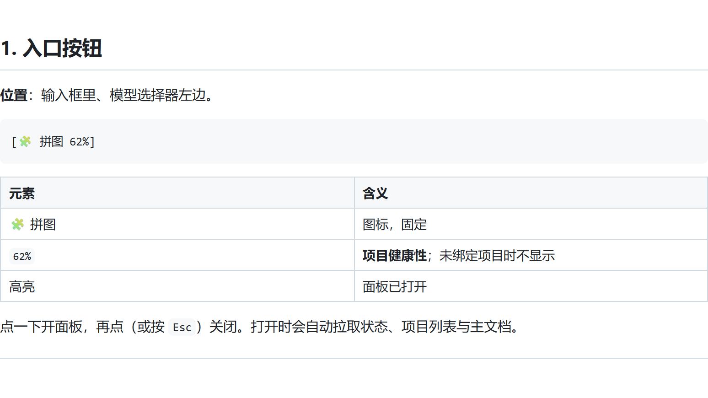
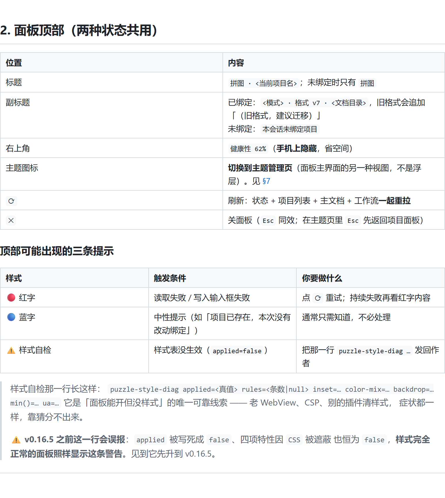
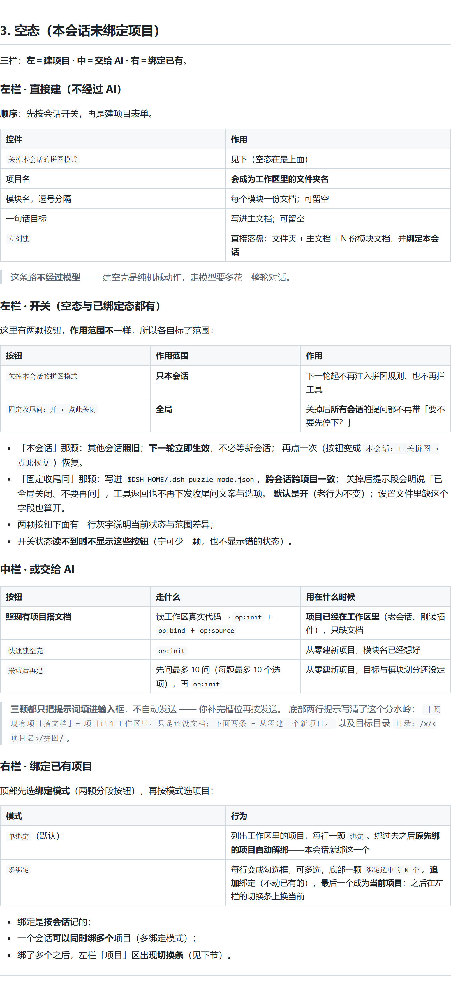
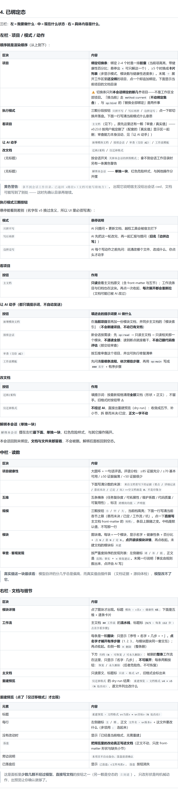
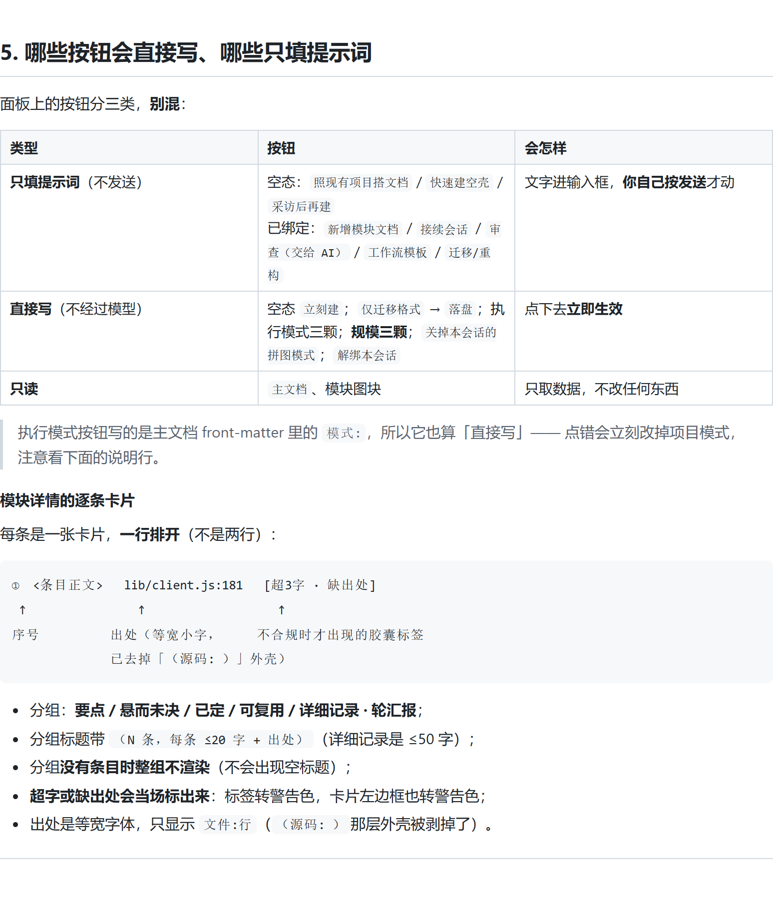
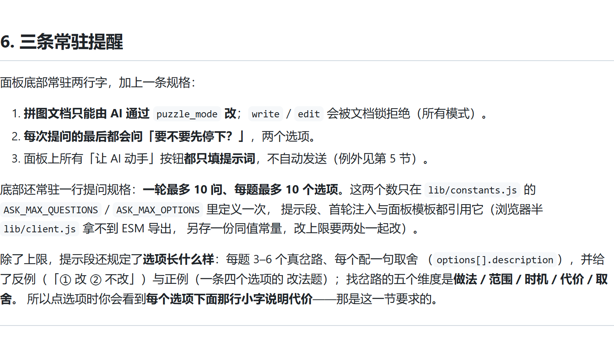

# 面板 UI 说明 · 每个地方有什么用

> 对应 v0.24.2。面板是输入框左边那颗小按钮点开的浮层。
> 本文只讲 **UI 上有什么、点了会怎样**；安装、模式语义、文档规格见 [README](README.md)。
>
> 每节的图是**照着本文件渲染**出来的（`node tools/render-tutorial.mjs`），
> 与正文同源，改完正文重跑一次即可——不存在「图与文字对不上」的中间态。
> 整份一图流：[`.github/images/ui-tutorial.png`](.github/images/ui-tutorial.png)
> （约 8000px 高，适合存档或整份转发；逐节阅读请直接看各节自己的图）。

---

## 1. 入口按钮

**位置**：输入框里、模型选择器左边。

```
[🧩 拼图 62%]
```

| 元素 | 含义 |
| --- | --- |
| 🧩 拼图 | 图标，固定 |
| `62%` | **项目健康性**；未绑定项目时不显示 |
| 高亮 | 面板已打开 |

点一下开面板，再点（或按 `Esc`）关闭。打开时会自动拉取状态、项目列表与主文档。



---

## 2. 面板顶部（两种状态共用）

| 位置 | 内容 |
| --- | --- |
| 标题 | `拼图 · <当前项目名>`；未绑定时只有 `拼图` |
| 副标题 | 已绑定：`<模式> · 格式 v7 · <文档目录>`，旧格式会追加「（旧格式，建议迁移）」<br>未绑定：`本会话未绑定项目` |
| 右上角 | `健康性 62%`（**手机上隐藏**，省空间） |
| `⟳` | 刷新：状态 + 项目列表 + 主文档 + 工作流**一起重拉** |
| `✕` | 关面板（`Esc` 同效） |

### 顶部可能出现的三条提示

| 样式 | 触发条件 | 你要做什么 |
| --- | --- | --- |
| 🔴 红字 | 读取失败 / 写入输入框失败 | 点 `⟳` 重试；持续失败再看红字内容 |
| 🔵 蓝字 | 中性提示（如「项目已存在，本次没有改动绑定」） | 通常只需知道，不必处理 |
| ⚠️ 样式自检 | 样式表没生效（`applied=false`） | 把那一行 `puzzle-style-diag …` 发回作者 |

> 样式自检那一行长这样：
> `puzzle-style-diag applied=<真值> rules=<条数|null> inset=… color-mix=… backdrop=… min()=… ua=…`
> 它是「面板能开但没样式」的唯一可靠线索 —— 老 WebView、CSP、别的插件清样式，
> 症状都一样，靠猜分不出来。
>
> ⚠️ **v0.16.5 之前这一行会误报**：`applied` 被写死成 `false`、四项特性因 `CSS` 被遮蔽
> 也恒为 `false`，**样式完全正常的面板照样显示这条警告**。见到它先升到 v0.16.5。




---

## 3. 空态（本会话未绑定项目）

三栏：**左＝建项目 · 中＝交给 AI · 右＝绑定已有**。

### 左栏 · 直接建（不经过 AI）

**顺序**：先按会话开关，再是建项目表单。

| 控件 | 作用 |
| --- | --- |
| `关掉本会话的拼图模式` | 见下（空态在最上面） |
| 项目名 | **会成为工作区里的文件夹名** |
| 模块名，逗号分隔 | 每个模块一份文档；可留空 |
| 一句话目标 | 写进主文档；可留空 |
| `立刻建` | 直接落盘：文件夹 + 主文档 + N 份模块文档，并**绑定本会话** |

> 这条路**不经过模型** —— 建空壳是纯机械动作，走模型要多花一整轮对话。

### 左栏 · 按会话开关（**空态与已绑定态都有**）

| 按钮 | 作用 |
| --- | --- |
| `关掉本会话的拼图模式` | 只关**当前这个会话**：下一轮起不再注入拼图规则、也不再拦工具 |

- 其他会话**照旧**；
- **下一轮立即生效**，不必等新会话；
- 再点一次（按钮变成 `本会话：已关拼图 · 点此恢复`）恢复；
- 关掉时旁边会多一行说明「只影响**本会话**，其他会话照旧；点一下即可恢复」；
- 开关状态**读不到时不显示这颗按钮**（宁可少一颗，也不显示错的状态）。

### 中栏 · 或交给 AI

| 按钮 | 走什么 | 用在什么时候 |
| --- | --- | --- |
| **照现有项目搭文档** | 读工作区真实代码 → `op:init` + `op:bind` + `op:source` | **项目已经在工作区里**（老会话、刚装插件），只缺文档 |
| `快速建空壳` | `op:init` | 从零建新项目，模块名已经想好 |
| `采访后再建` | 先问最多 10 问（每题最多 10 个选项），再 `op:init` | 从零建新项目，目标与模块划分还没定 |

> **三颗都只把提示词填进输入框**，不自动发送 —— 你补完槽位再按发送。
> 底部两行提示写清了这个分水岭：
> `「照现有项目搭文档」= 项目已在工作区里，只是还没文档；下面两条 = 从零建一个新项目。`
> 以及目标目录 `目录：/x/<项目名>/拼图/`。

### 右栏 · 绑定已有项目

顶部先选**绑定模式**（两颗分段按钮），再按模式选项目：

| 模式 | 行为 |
| --- | --- |
| `单绑定`（默认） | 列出工作区里的项目，每行一颗 `绑定`。绑过去之后**原先绑的项目自动解绑**——本会话就绑这一个 |
| `多绑定` | 每行变成勾选框，可多选，底部一颗 `绑定选中的 N 个`。**追加**绑定（不动已有的），最后一个成为**当前项目**；之后在左栏的切换条上换当前 |

- 绑定是**按会话**记的；
- 一个会话**可以同时绑多个**项目（多绑定模式）；
- 绑了多个之后，左栏「项目」区出现**切换条**（见下节）。




---

## 4. 已绑定态

三栏：**左＝我要做什么 · 中＝现在什么状态 · 右＝具体内容是什么**。

### 左栏 · 项目 / 模式 / 动作

**顺序就是渲染顺序**（从上到下）：

| 区块 | 内容 |
| --- | --- |
| **项目** | **绑定切换条**：绑定 2–4 个时是一排**胶囊**（当前项高亮，带健康性百分比；悬停出 `×` 可只解这一个），≥5 个时换成**卡片列表**（多显示模式、模块数与健康性进度条）。末尾 `＋` 展开工作区里**还没绑**的项目，点一个即追加绑定。下面显示当前项目的文档目录 |
| | ⚠️ 切换条只列**本会话绑定的那几个**项目——不是工作区全部项目。「换当前」走 `method:current`（**不动绑定集合**），与 `op:bind` 的「替换全部绑定」是两件事 |
| **执行模式** | 三颗分段按钮 `只拼不写` / `写后再拼` / `边拼边写`；点一下即切换并落盘。下面一行写清当前模式什么意思 |
| **看项目** | `主文档`（见下）。原先这里还有一颗「审查 / 真实值」——v0.23.0 按用户裁定删了（配套的「真实值」显示区一起删；审查能力本身没动，见「让 AI 动手」） |
| **让 AI 动手** | `新增模块文档` / `接续会话` / `审查（交给 AI）` / `工作流模板` |
| **改文档** | `迁移/重构` / `仅迁移格式` |
| （无标题） | 按会话开关 `关掉本会话的拼图模式`；拿不到会话工作目录时另有一条黄色警告 |
| （无标题） | `解绑本会话` —— **单独一块**，红色危险样式，与其他操作分开摆 |

> **黄色警告**：`拿不到会话工作目录，已退回 <路径>（文档可能写错地方）`。
> 出现它说明宿主没给出会话 cwd，文档可能写到了别处 —— 这时先确认目录再继续。

#### 执行模式三颗按钮

悬停能看到差别（名字在 v5 换过含义，所以 UI 里必须写清）：

| 模式 | 悬停说明 |
| --- | --- |
| `只拼不写` | AI 只提问 + 更新文档，越权工具会被宿主拦下 |
| `写后再拼` | AI 先把这一轮改完，再一起汇报与提问（**旧名「边拼边写」**） |
| `边拼边写` | AI 每个写动作之前先问：说清改哪个文件、改成什么，你点头才动手 |

#### 看项目

| 按钮 | 作用 |
| --- | --- |
| `主文档` | **只读**查看主文档原文（含 front-matter 与五节）；工作流条目与归档也在这块。再点一次收起，**每次展开都会重新拉**（文档可能已被 AI 改过） |

#### 让 AI 动手（都只填提示词，不自动发送）

| 按钮 | 填进去的提示词要 AI 做什么 |
| --- | --- |
| `新增模块文档` | 在**当前项目**里再加一份模块文档，并同步主文档的「模块索引」（**不会新建项目、不动已有文档**） |
| `接续会话` | 新会话按需读：先 `op:read` → 只读主文档 → 只读相关那一个模块，**不通读全部**；读到断点就接着干，**不自己翻代码推评估**（那交给审查） |
| `审查（交给 AI）` | 按五维审查这个项目，并出可执行修复清单 |
| `工作流模板` | 先问清**是哪条流程、依次哪些步骤**，再用 `op:main` 写成 `### 名字` + 有序步骤 |

#### 改文档

| 按钮 | 作用 |
| --- | --- |
| `迁移/重构` | 填提示词：按最新规格清理**全部**文档（形状 + 正文），不留手。旧格式时按钮带 ⚠ |
| `仅迁移格式` | **不经过 AI**，直接出重建预览（dry-run）：收敛成五节、补小节、拆 悬而未决/已定，**正文一字不动** |

#### 解绑本会话（单独一块）

`解绑本会话` 摆在左栏**最下面、单独一块**，红色危险样式，与其它操作隔开。

本会话回到未绑定。**文档与文件夹都留着**，不会被删。解绑后面板回到空态。

### 中栏 · 读数

| 区块 | 内容 |
| --- | --- |
| **项目健康性** | 大圆环 + 一句话评语。评语分档：≥85 证据充分 / ≥70 基本可用 / ≥50 证据偏薄 / <50 证据很少 |
| | 下面写清分数的来源：`来自文档里写下的证据（要点 / 详细记录 / 悬而未决 / 已定 / 坑）——空文档就是 0，不是印象分` |
| **五维** | 五条横条（任务复杂度 / 可拓展性 / 维护系数 / 代码质量 / 可复用性），标注 `跨模块均值 · 声明值` |
| **规模** | 三颗按钮 `小` / `中` / `大`，当前档高亮；下面一行写清当前各节上限（悬而未决 / 已定 / 工作流 / 坑）。点一下**直接写**主文档 front-matter 的 `规模:`，条目上限随之变。中档是默认值，不写那一行 |
| **模块** | 图块墙。每块＝一个模块，显示名字 + 健康性条 + 百分比 + `点 N / 悬 N / 定 N`。**点开读该模块详情**，再点收起。未建文档的模块标 `未建` |
| **审查 · 客观发现** | 按严重度排序的发现列表：左侧徽标 `堵` / `补` / `提`，正文是 `范围：事实` + `→ 修复建议`。末尾一行说明「事实由规则数出来，点评由 AI 写」 |

> **真实值这一块最该看**：模型自评的分几乎总是偏高，而真实值由插件算
> （文档证据 + 源码体检），**模型改不了它**。

### 右栏 · 文档与细节

| 区块 | 内容 |
| --- | --- |
| **模块详情** | 点了图块才出现。标题 `模块 · <名> · 健康性 N%`；下面是五维 + 逐条卡片 |
| **工作流** | 主文档 `## 工作流` 的**流水线**，标题标 `(N/5 · 每条 ≤12 步 · 点名字看步骤)` |
| | 每条是一颗**图块**：只显示「序号 + 名字 + 几步 + ▸」。**点名字才铺开有序步骤**（1. 2. 3.，与模块图块同一套交互）；再点收起。右侧一颗 `✕ 删除`（整条删） |
| | 下方 `归档（N · 可恢复 / 可永久删除）`：被删的**整条**工作流在这里，只显示「名字 · 几步」，**不可展开**；每条两颗按钮：`恢复` / `永久删除`（后者危险色，不可恢复） |
| **主文档** | 只读原文，标题标 `只读 · 格式 v7`，旧格式会标出来 |
| **重建预览** | `仅迁移格式` 的 dry-run 结果：`重建预览 · 文档格式 v4 → v5（N 处改动）`，逐文件列出改什么 |

#### 重建预览（点了「仅迁移格式」才出现）

| 元素 | 内容 |
| --- | --- |
| 标题 | `重建预览 · 文档格式 v<当前> → v<目标>（N 处改动）` |
| 每行 | 左侧徽标 `主` / `模`，正文 `文件名 · v<版本>` + 这文件要改什么（多项用 `；` 连起来） |
| 没有改动时 | 显示「已经是当前格式，无需重建」 |
| `落盘` | **把预览里的改动真正写进文档**（正文不动，只改 front-matter 形状与缺失小节） |
| 旁边说明 | `本项目不自动备份，落盘前请确认` |
| 已落盘后 | 显示 `已落盘：<文件列表>`，`落盘` 按钮消失 |

> 这是面板里**少数几颗不经过模型、直接写文档**的按钮之一（另一颗是空态的 `立刻建`）。
> 只改形状是纯机械动作，出预览让你确认就够了。




---

## 5. 哪些按钮会直接写、哪些只填提示词

面板上的按钮分三类，**别混**：

| 类型 | 按钮 | 会怎样 |
| --- | --- | --- |
| **只填提示词**（不发送） | 空态：`照现有项目搭文档` / `快速建空壳` / `采访后再建`<br>已绑定：`新增模块文档` / `接续会话` / `审查（交给 AI）` / `工作流模板` / `迁移/重构` | 文字进输入框，**你自己按发送**才动 |
| **直接写**（不经过模型） | 空态 `立刻建`；`仅迁移格式` → `落盘`；执行模式三颗；**规模三颗**；`关掉本会话的拼图模式`；`解绑本会话` | 点下去**立即生效** |
| **只读** | `主文档`、模块图块 | 只取数据，不改任何东西 |

> 执行模式按钮写的是主文档 front-matter 里的 `模式:`，所以它也算「直接写」——
> 点错会立刻改掉项目模式，注意看下面的说明行。

#### 模块详情的逐条卡片

每条是一张卡片，**一行排开**（不是两行）：

```
①  <条目正文>   lib/client.js:181   [超3字 · 缺出处]
 ↑                ↑                   ↑
序号          出处（等宽小字，     不合规时才出现的胶囊标签
              已去掉「（源码: ）」外壳）
```

- 分组：**要点 / 悬而未决 / 已定 / 可复用 / 详细记录 · 轮汇报**；
- 分组标题带 `（N 条，每条 ≤20 字 + 出处）`（详细记录是 ≤50 字）；
- 分组**没有条目时整组不渲染**（不会出现空标题）；
- **超字或缺出处会当场标出来**：标签转警告色，卡片左边框也转警告色；
- 出处是等宽字体，只显示 `文件:行`（`（源码: ）`那层外壳被剥掉了）。




---

## 6. 三条常驻提醒

面板底部常驻两行字，加上一条规格：

1. **拼图文档只能由 AI 通过 `puzzle_mode` 改**；`write` / `edit` 会被文档锁拒绝（所有模式）。
2. **每次提问的最后都会问「要不要先停下？」**，两个选项。
3. 面板上所有「让 AI 动手」按钮**都只填提示词**，不自动发送（例外见第 5 节）。

底部还常驻一行提问规格：**一轮最多 10 问、每题最多 10 个选项**。这两个数只在
`lib/constants.js` 的 `ASK_MAX_QUESTIONS` / `ASK_MAX_OPTIONS` 里定义一次，
提示段、首轮注入与面板模板都引用它（浏览器半 `lib/client.js` 拿不到 ESM 导出，
另存一份同值常量，改上限要两处一起改）。

除了上限，提示段还规定了**选项长什么样**：每题 3–6 个真岔路、每个配一句取舍
（`options[].description`），并给了反例（「① 改 ② 不改」）与正例（一条四个选项的
改法题）；找岔路的五个维度是**做法 / 范围 / 时机 / 代价 / 取舍**。
所以点选项时你会看到**每个选项下面那行小字说明代价**——那是这一节要求的。




---

## 7. 手机端

窄屏（<900px）自动变成**单栏 + 面板内滚动**：

- 三栏纵向堆叠，栏间改横线分隔；
- 面板高度上限放宽到 `92vh`；
- 顶部那颗 `健康性 N%` 隐藏（标题副标题里仍有模式与目录）。


---

## 附：按钮总览（一屏速查）

**空态**

```
左：关掉本会话的拼图模式
    项目名 / 模块名 / 目标  →  立刻建
中：照现有项目搭文档 · **扫工作区 · 一次建多个** · 快速建空壳 · 采访后再建
右：绑定（已有项目列表）
     ↓ 点「扫工作区」后在中栏下方出现勾选器：
       列出还没有拼图文档的顶层目录（带目录内文件名当证据）
       → 勾选 → 「建这 N 个」= 每个建一份主文档 + **全部追加绑定**（最后一个是当前）
```

**已绑定**

```
左：绑定切换条（只列绑定的项目）· 执行模式×3
    审查/真实值 · 主文档
    新增模块文档 · 接续会话 · 审查（交给 AI） · 工作流模板
    迁移/重构 · 仅迁移格式          ← 多绑定时**作用于全部绑定**（逐项目预览 + 一起落盘）
    关掉本会话的拼图模式
    解绑本会话                    ← 单独一块，红色
中：健康性圆环 · 五维 · 规模 · 模块图块 · 客观发现
右：模块详情 · 工作流图块(+归档) · 主文档 · 重建预览(+落盘)
```


